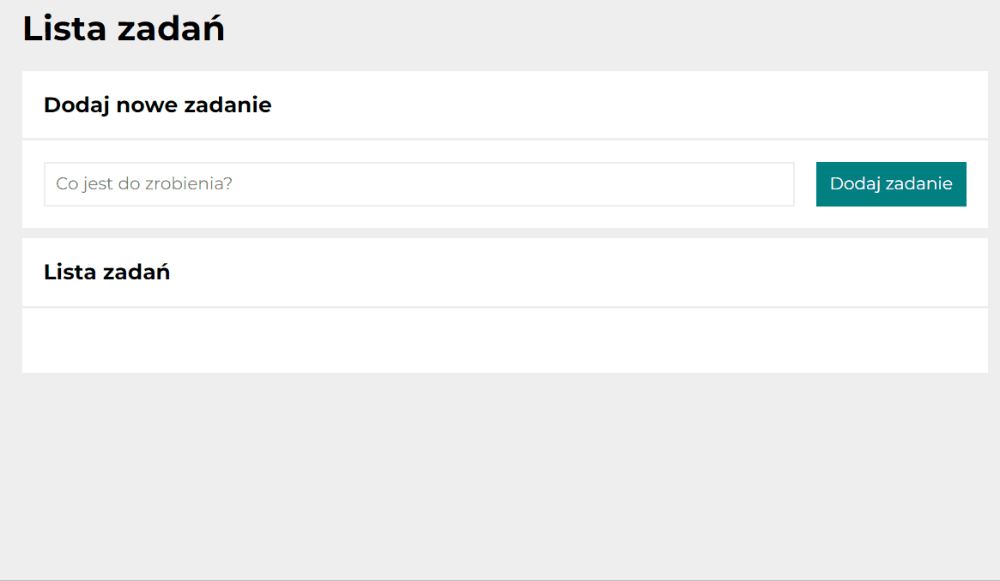

# To-do list

The "Lista zadań" program is a simply app to allows you to do list.

## How to use:

1. Whrite a new task and click the blue-green button "Dodaj zadanie".
2. If the task was done, mark the green button on the left.
3. Delete the task by red button.
4. If you want to mark all your tasks as done, click the button "Ukończ wszystkie".
5. Hide or show done tasks with the button "Ukryj/Pokaż ukończone". 

If you want to use it, click [here](https://doncochino.github.io/To-do-list/).

## Technologies:
- HTML
- CSS
- BEM
- JavaScript
- MediaQueries
- Iimmutability